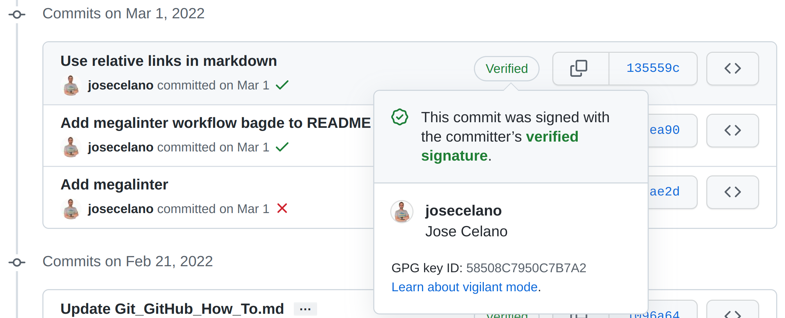
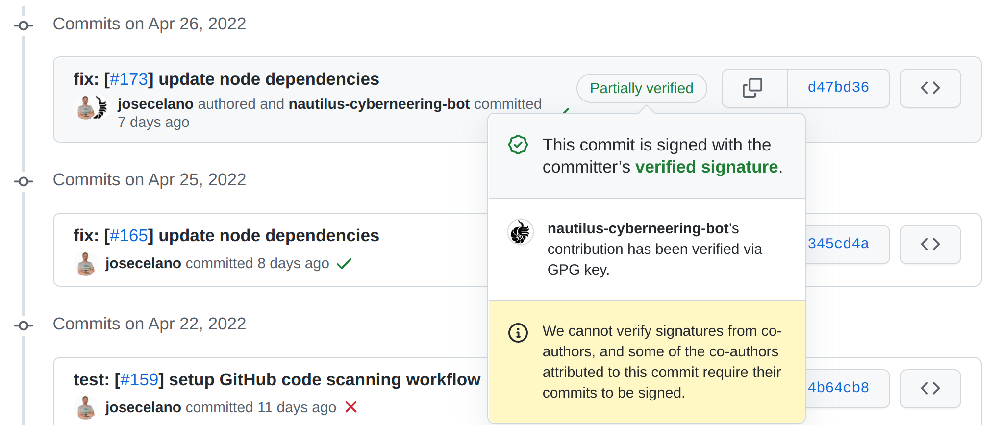

# GPG - Git commits partially verified


On [GitHub](https://github.com/), you can [enable vigilant mode for commit signature verification](https://docs.github.com/en/authentication/managing-commit-signature-verification/displaying-verification-statuses-for-all-of-your-commits). That means that GitHub will verify the signature of your commits and it will show a message like this:



It will verify not only the commits were you are the committer but also commits where you are the author.

That is the straightforward case. However, there are some cases where you can get unexpected behaviour. We will describe some corner cases regarding signing git commits, but before that, we have to explain some basic Git concepts related to commit signatures.

## Basic Git concepts related to commit signatures

### Committer vs author

The "committer" is the person who executes the commit command `git commit`. Git gets the committer name and email from the Git configuration, and it is usually the global configuration.

```s
$ git config -l | grep user
user.name=Jose Celano
user.email=josecelano@gmail.com
user.signingkey=58508C7950C7B7A2
```

If you do not specify an author, Git assumes that the author is the same as the committer. You can also override the committer and the author using environment variables:

```text
GIT_AUTHOR_NAME
GIT_AUTHOR_EMAIL
GIT_COMMITTER_NAME
GIT_COMMITTER_EMAIL
```

For the author you have a command option too (`git commit -m "..." --author="Your Name <your@email.com>"`).

### Commit signature in Git

Git also allows you to sign a commit with a GPG key.

From the [Git official documentation about GPG signature](https://git-scm.com/docs/signature-format):

> _The command which is about to create an object (commit) determines a payload from that, calls gpg to obtain a detached signature for the payload (gpg -bsa) and embeds the signature into the object or transaction._

You can use any GPG key. Usually the GPG user ID matches the committer info. If you have this configuration in your `~/.gitconfig` file:

```s
$ cat ~/.gitconfig
[user]
  name = A committer
  email = committer@example.com
  signingkey = BD98B3F42545FF93EFF55F7F3F39AA1432CA6AD7
```

You will probably have a GPG key like this:

```s
gpg -k --with-subkey-fingerprint 88966A5B8C01BD04F3DA440427304EDD6079B81C
pub   rsa4096 2021-11-19 [C]
      88966A5B8C01BD04F3DA440427304EDD6079B81C
uid           [ultimate] A committer <committer@example.com>
sub   rsa4096 2021-11-19 [E]
      B1D4A2483D1D2A02416BE0775B6BDD35BEDFBF6F
sub   rsa4096 2021-11-26 [S]
      BD98B3F42545FF93EFF55F7F3F39AA1432CA6AD7
```

In Git you can commit using a different committer and author, and also with a GPG key with a different user ID.

```s
GIT_COMMITTER_NAME="Jose Celano [bot]" \
GIT_COMMITTER_EMAIL="bot@josecelano.com" \
GIT_AUTHOR_NAME="Jose Celano" \
GIT_AUTHOR_EMAIL="josecelano@gmail.com" \
  git commit --gpg-sign=BD98B3F42545FF93EFF55F7F3F39AA1432CA6AD7 -m "commit message"
```

This is how the commit looks`:

```s
commit d89b296e9d58cc4281aeead172b170739acc164c (HEAD -> main)
gpg: Signature made jue 12 may 2022 15:36:29 WEST
gpg:                using RSA key BD98B3F42545FF93EFF55F7F3F39AA1432CA6AD7
gpg: Good signature from "A committer <committer@example.com>" [ultimate]
Author:     Jose Celano <josecelano@gmail.com>
AuthorDate: Thu May 12 15:36:29 2022 +0100
Commit:     Jose Celano [bot] <bot@josecelano.com>
CommitDate: Thu May 12 15:36:29 2022 +0100

    commit message

```

### Commit signature on GitHub

That is how Git works, but [GitHub](https://github.com/) does not work exactly like Git. On the [GitHub Documentation](https://docs.github.com/en/authentication/managing-commit-signature-verification/generating-a-new-gpg-key#generating-a-gpg-key) you can read:

> Note: _When asked to enter your email address, ensure that you enter the verified email address for your GitHub account. To keep your email address private, use your GitHub-provided no-reply email address. For more information, see "Verifying your email address" and "Setting your commit email address."_

GitHub forces you to a use a GPG key whose user ID matches one of your GitHub account emails, so that when GitHub verified the signature not only verifies that the signature is OK but it also verifies that committer's email and account email match.

> _You should only enable vigilant mode if you sign all of your commits and tags and use an email address that is verified for your account on GitHub as your committer email address._

GitHub shows you a simplified version of Git. Because it links the GPG key to the committer. Although is not a Git constraint it is a common practice. [GitLab](https://docs.gitlab.com/ee/user/project/repository/gpg_signed_commits/) seems to do exactly the same:

> _For GitLab to consider a commit verified:_
>
> - _The committer must have a GPG public/private key pair._
> - _The committer’s public key must be uploaded to their GitLab account._
> - _One of the email addresses in the GPG public key must match a verified email address used by the committer in GitLab. To keep this address private, use the automatically generated private commit email address GitLab provides in your profile._
> - _The committer’s email address must match the verified email address from the GPG key._

For the rest of this article we assume that the GPG key fulfills the requirements in the GitLab documentation. We do not know if GitHub has exactly the same restrictions as we have not found documentation about it.

## Git commit with multiple GPG signatures

Git does not allow to add more than one GPG signature to a commit. What Git does is generate the commit object and sign it with GPG. The signature is then added as a [commit header](https://git-scm.com/docs/signature-format#_commit_signatures).

We have not found a reason why Git does not support multiple signatures. Since Git only relays on the GPG console command, we thought the reason was that GPG did not support it either, but as you can read on this [Stackoverflow answer](https://stackoverflow.com/questions/37725969/several-pgp-signatures-for-one-file/37759313#37759313), there are two ways to add multiple signatures to a file using GPG.

The first solution is to sign the contents with one key and sign the result again with the following key until you sign it with all the keys.

The second solution would be using "detached signatures", which means the signature is not included in the signed document. We suppose Git could have used this approach, and [this article from Owen Jacobson(](https://grimoire.ca/git/detached-sigs/) describes it in detail. But it is not the case. Although Git uses "detached signatures", the signature is included as a commit header inside the "full" commit object that is used to calculate the commit hash. That means changing the signature changes the commit hash.

## Git merge, rebase and GPG signature

So, we know that Git does not allow including the author's signature and the committer's signature. We have the restriction that you can only add one signature to each commit. That means you will permanently lose the author's signature when you commit someone else's code. You could include the author's signature instead of the committer's one but that is not an standard practice. If you want to include the author's signature your can keep the original commit, for example, by using git merge (with a merge commit) to merge branches.

We will see whether that is important or not, why it is crucial, and how you can deal with this problem. However, before that, we need to understand what happens when a committer specifies a different author and other cases where the author changes automatically.

When you use the `git rebase` command with a different committer than the original commits, Git will keep the original author as the author of the newly generated commits.

```s
echo "Initialize repo"
mkdir /tmp/git-test
cd /tmp/git-test/
git init
echo "Add a file as maintainer"
touch a.txt
git add -A
GIT_COMMITTER_NAME="maintainer" \
GIT_COMMITTER_EMAIL="maintainer@email.com" \
GIT_AUTHOR_NAME="maintainer" \
GIT_AUTHOR_EMAIL="maintainer@email.com" \
  git commit --no-gpg-sign -m "add a.txt"
echo "Add a file as contributor on a topic branch"
git checkout -b topic-branch
touch b.txt
git add -A
GIT_COMMITTER_NAME="contributor" \
GIT_COMMITTER_EMAIL="contributor@email.com" \
GIT_AUTHOR_NAME="contributor" \
GIT_AUTHOR_EMAIL="contributor@email.com" \
  git commit --no-gpg-sign -m "add b.txt"
git show --pretty=fuller HEAD
echo "Add another file as maintainer on the main branch"
git checkout main
touch c.txt
git add -A
GIT_COMMITTER_NAME="maintainer" \
GIT_COMMITTER_EMAIL="maintainer@email.com" \
GIT_AUTHOR_NAME="maintainer" \
GIT_AUTHOR_EMAIL="maintainer@email.com" \
  git commit --no-gpg-sign -m "add c.txt"
echo "Rebase topic-branch as maintainer"
git checkout topic-branch
GIT_COMMITTER_NAME="maintainer" \
GIT_COMMITTER_EMAIL="maintainer@email.com" \
GIT_AUTHOR_NAME="maintainer" \
GIT_AUTHOR_EMAIL="maintainer@email.com" \
  git rebase main
git log --pretty=fuller
```

If you execute the script, you will see the original contributor commit:

```s
commit 148628f7f3f0f0a908ab5889e066eba842f4da66 (HEAD -> topic-branch)
Author:     contributor <contributor@email.com>
AuthorDate: Mon May 2 15:43:09 2022 +0100
Commit:     contributor <contributor@email.com>
CommitDate: Mon May 2 15:43:09 2022 +0100

    add b.txt
```

And the commit after the rebase:

```s
commit 71f8feb30f8b02f26ddee67385152e25a774704f (HEAD -> topic-branch)
Author:     contributor <contributor@email.com>
AuthorDate: Mon May 2 15:43:09 2022 +0100
Commit:     maintainer <maintainer@email.com>
CommitDate: Mon May 2 15:43:09 2022 +0100

    add b.txt
```

If you merge the `topic-branch` into the `main` branch with fast-forward:

```s
git checkout main
GIT_COMMITTER_NAME="maintainer" \
GIT_COMMITTER_EMAIL="maintainer@email.com" \
  git merge --ff-only topic-branch
```

you will have the same commit `71f8feb30f8b02f26ddee67385152e25a774704f` re-created by the maintainer in the main branch.

```s
git show --pretty=fuller HEAD
commit 71f8feb30f8b02f26ddee67385152e25a774704f (HEAD -> main, topic-branch)
Author:     contributor <contributor@email.com>
AuthorDate: Mon May 2 15:43:09 2022 +0100
Commit:     maintainer <maintainer@email.com>
CommitDate: Mon May 2 15:43:09 2022 +0100

    add b.txt
```

As you can see, Git keeps the author (`contributor <contributor@email.com>`) of the original commit.

On the other hand, the maintainer could merge the `topic-branch` with a merge commit:

```s
echo "Initialize repo"
mkdir /tmp/git-test
cd /tmp/git-test/
git init
echo "Add a file as maintainer"
touch a.txt
git add -A
GIT_COMMITTER_NAME="maintainer" \
GIT_COMMITTER_EMAIL="maintainer@email.com" \
GIT_AUTHOR_NAME="maintainer" \
GIT_AUTHOR_EMAIL="maintainer@email.com" \
  git commit --no-gpg-sign -m "add a.txt"
echo "Add a file as contributor on a topic branch"
git checkout -b topic-branch
touch b.txt
git add -A
GIT_COMMITTER_NAME="contributor" \
GIT_COMMITTER_EMAIL="contributor@email.com" \
GIT_AUTHOR_NAME="contributor" \
GIT_AUTHOR_EMAIL="contributor@email.com" \
  git commit --no-gpg-sign -m "add b.txt"
git show --pretty=fuller HEAD
echo "Merge topic-branch as maintainer"
git checkout main
GIT_COMMITTER_NAME="maintainer" \
GIT_COMMITTER_EMAIL="maintainer@email.com" \
GIT_AUTHOR_NAME="maintainer" \
GIT_AUTHOR_EMAIL="maintainer@email.com" \
  git merge --no-ff topic-branch
git log --pretty=fuller
```

In this case, the contributor commit looks the same as in the previous example before rebasing:

```s
commit ac3b9f8eef024c30e59c01bce4943ad0597fab9c (HEAD -> topic-branch)
Author:     contributor <contributor@email.com>
AuthorDate: Mon May 2 15:52:37 2022 +0100
Commit:     contributor <contributor@email.com>
CommitDate: Mon May 2 15:52:37 2022 +0100

    add b.txt
```

And after merging:

```s
commit 1b75bfb9d0b4621560bf2c6158e937ea457bb4e5 (HEAD -> main)
Merge: 097e6ee ac3b9f8
Author:     maintainer <maintainer@email.com>
AuthorDate: Mon May 2 15:52:37 2022 +0100
Commit:     maintainer <maintainer@email.com>
CommitDate: Mon May 2 15:52:37 2022 +0100

    Merge branch 'topic-branch'

commit 097e6ee7f0088a54ec22712ce18fd08904d954b8
Author:     maintainer <maintainer@email.com>
AuthorDate: Mon May 2 15:52:37 2022 +0100
Commit:     maintainer <maintainer@email.com>
CommitDate: Mon May 2 15:52:37 2022 +0100

    add a.txt

commit ac3b9f8eef024c30e59c01bce4943ad0597fab9c (topic-branch)
Author:     contributor <contributor@email.com>
AuthorDate: Mon May 2 15:52:37 2022 +0100
Commit:     contributor <contributor@email.com>
CommitDate: Mon May 2 15:52:37 2022 +0100

    add b.txt
```

You still have the original commit `ac3b9f8eef024c30e59c01bce4943ad0597fab9c` and the new merge commit `1b75bfb9d0b4621560bf2c6158e937ea457bb4e5`.

Notice that you have to specify the author again for the git merge commit. Otherwise, the author would be your default committer info.
For the `git merge --ff-only topic-branch`, you do not have to specify the author. Git uses the original commit author.

> NOTE: we could test what happens when the original commit has a different committer and author. We suppose the author is what is propagated, but we should check it with an example.

If we were using GPG signatures, we would have only the committer signature on each final commit.

> NOTE: [GitHub "rebase and merge" button does not work exactly as Git rebase](https://docs.github.com/en/pull-requests/collaborating-with-pull-requests/incorporating-changes-from-a-pull-request/about-pull-request-merges#rebase-and-merge-your-pull-request-commits).

On GitHub documentation, you can read:

> "The rebase and merge behavior on GitHub deviates slightly from Git rebase. Rebase and merge on GitHub will always update the committer information and create new commit SHAs, whereas Git rebase outside of GitHub does not change the committer information when the rebase happens on top of an ancestor commit. For more information about Git rebase, see git-rebase in the Git documentation."

When it is possible to merge with fast-forward, Git will not change the original committer info. If you rerun the merge example using rebase with fast-forward:

```s
echo "Initialize repo"
mkdir /tmp/git-test
cd /tmp/git-test/
git init
echo "Add a file as maintainer"
touch a.txt
git add -A
GIT_COMMITTER_NAME="maintainer" \
GIT_COMMITTER_EMAIL="maintainer@email.com" \
GIT_AUTHOR_NAME="maintainer" \
GIT_AUTHOR_EMAIL="maintainer@email.com" \
  git commit --no-gpg-sign -m "add a.txt"
echo "Add a file as contributor on a topic branch"
git checkout -b topic-branch
touch b.txt
git add -A
GIT_COMMITTER_NAME="contributor" \
GIT_COMMITTER_EMAIL="contributor@email.com" \
GIT_AUTHOR_NAME="contributor" \
GIT_AUTHOR_EMAIL="contributor@email.com" \
  git commit --no-gpg-sign -m "add b.txt"
git show --pretty=fuller HEAD
echo "Merge topic-branch as maintainer"
git checkout main
  git merge --ff-only topic-branch
git log --pretty=fuller
```

The original contributor commits should be something like:

```s
commit d81c1a285a1a82fcdd8732ea159a58f66e082e1d (HEAD -> topic-branch)
Author:     contributor <contributor@email.com>
AuthorDate: Mon May 2 16:22:28 2022 +0100
Commit:     contributor <contributor@email.com>
CommitDate: Mon May 2 16:22:28 2022 +0100

    add b.txt
```

And you can see the same commit after the merge:

```s
commit d81c1a285a1a82fcdd8732ea159a58f66e082e1d (HEAD -> main, topic-branch)
Author:     contributor <contributor@email.com>
AuthorDate: Mon May 2 16:22:28 2022 +0100
Commit:     contributor <contributor@email.com>
CommitDate: Mon May 2 16:22:28 2022 +0100

    add b.txt

commit 176fa5d4b50bacc9e608d4cfad5957bd156da775
Author:     maintainer <maintainer@email.com>
AuthorDate: Mon May 2 16:22:28 2022 +0100
Commit:     maintainer <maintainer@email.com>
CommitDate: Mon May 2 16:22:28 2022 +0100

    add a.txt
```

That commit keeps the committer and author values. GitHub would override the committer info with the info of the logged-in user. GitHub does something like:

```s
git checkout main
GIT_COMMITTER_NAME="maintainer" \
GIT_COMMITTER_EMAIL="maintainer@email.com" \
  git merge --ff-only topic-branch
```

[More info on a GitHub blog post](https://github.blog/2016-09-26-rebase-and-merge-pull-requests/).

## How to keep the chain of trust

Now we know:

- How Git uses the committer and author information.
- How Git deals with commit signatures.
- How GitHub works slightly different overwriting the committer info when you use the "rebase and merge" on a pull request.

What happens when we create a new commit?

When a new commit is created, we need to sign it again with the committer GPG key. That leads to two problems:

1. We can lose the commit signature.
2. We lose the author's signature.

Let us start with point 1, having not signed commits.

If we re-create new commits using rebase, we lose the original author signature, but we can add the maintainer one, as long as we do it in an environment where the GPG private key is available. For example, if you use the "rebase and merge" button provided by the GitHub UI, the new commit will not be signed because GitHub does not have the committer signing key. You can use a console command where the maintainer GPG private key is available.

That forces you to stop using GitHub UI for merging pull requests if you want all your commits to be signed.

Regarding point 2, losing the author's signature, we first must consider why we do not want to lose it.

We can consider the signature a mechanism to review/accept changes. If we consider only the maintainers the final responsible for our code, losing the author's signature is not critical, as long as the maintainers make sure changes come from a trusted source. In this case, we are not breaking the trust. It is just that we trust maintainers, and they check signatures for other contributors they trust. The maintainers should ensure that commits on a pull request are signed by contributors they trust before merging them.

On the other hand, It would be nice to keep that trust chain transparent so people using a package can check that third-party contributors' changes were accepted without changes.

If you do not want to lose the author's signature, one obvious solution is to merge only using merge commits.

It is out of the scope of this article to describe the pros and cons of losing or not losing the author's signature. A fascinating [article by Mike Gerwitz](https://mikegerwitz.com/2012/05/a-git-horror-story-repository-integrity-with-signed-commits#trust-ensure) explains the different alternatives in detail.

When this happens on GitHub, you see this message on the commit status (if you have vigilant mode enabled):



Maybe losing the author's signature is not an issue from the package user or the maintainers' point of view. However, from the author's point of view, you can not distinguish anymore between your legitimate commits and the fake ones. Someone else could pretend you have collaborated with their project. It is surprisingly easy to do that. You only need to create a commit and override the author with any users on GitHub.

## Conclusion

When you use signed commits:

- Be aware of the Git limitation of one single signature per commit.
- Be also aware of what happens to signatures when you use Git commands like "merge" and "rebase".
- Define your git branching/merging and release strategy according to your web of trust.
- Be prepared to stop using the GitHub UI and define your processes and scripts.

## Links

- Article by Mike Gerwitz: [A Git Horror Story: Repository Integrity With Signed Commits](https://mikegerwitz.com/2012/05/a-git-horror-story-repository-integrity-with-signed-commits#trust-ensure)

- Article by Owen Jacobson: [Notes Towards Detached Signatures in Git](https://grimoire.ca/git/detached-sigs/)

- Stackoverflow: [Several GPG signatures for one file](https://stackoverflow.com/a/37759313/3012842)

- Stackoverflow: [Git –sign-off feature](https://stackoverflow.com/questions/1962094/what-is-the-sign-off-feature-in-git-for)

- Hacker News: [Git-signatures – Multiple PGP signatures for your commits](https://news.ycombinator.com/item?id=19183803)

- Article by Michał Górny: [Attack on git signature verification via crafting multiple signatures](https://mgorny.pl/articles/attack-on-git-signature-verification.html)

- Git book: [Git Tools - Signing Your Work](https://git-scm.com/book/en/v2/Git-Tools-Signing-Your-Work)

- Git docs: [Git signature format](https://git-scm.com/docs/signature-format)

[Back to home](./index.md)
